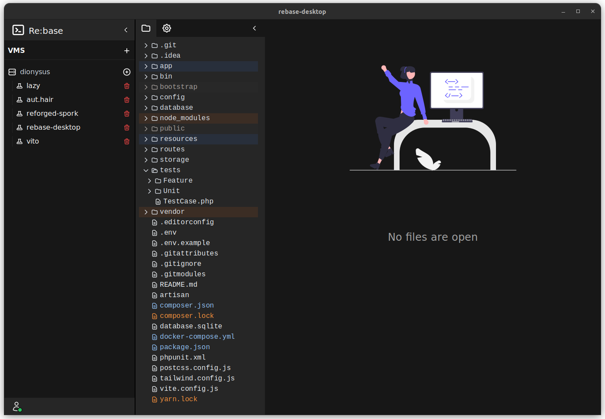

# Re:base Tauri
This project is written in Rust, and the frontend stack is Vue/Vite/Tailwind.

Heavily inspired by the UI of the now defunct [Koding](https://koding.com).

Goal: lightweight coding environments, deployable to any host.

Features:

- [x] Basic file saving
- [x] Set Projects, set directories

## Recommended IDE Setup

- [VS Code](https://code.visualstudio.com/) + [Volar](https://marketplace.visualstudio.com/items?itemName=Vue.volar) + [Tauri](https://marketplace.visualstudio.com/items?itemName=tauri-apps.tauri-vscode) + [rust-analyzer](https://marketplace.visualstudio.com/items?itemName=rust-lang.rust-analyzer)
